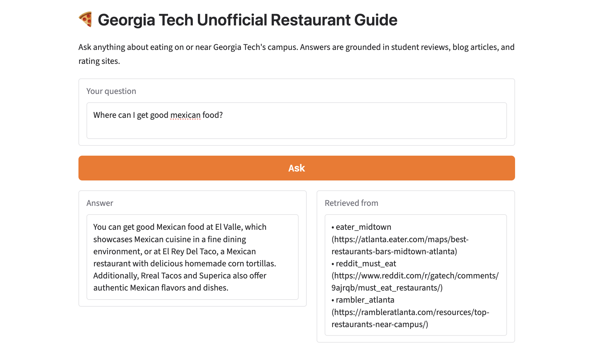

# The Unofficial Guide — Project 1

## Domain

The domain chosen for this unofficial guide project is best places to eat around campus and surrounding areas. It was chosen because restaurant websites and official review sites don't accurately reflect the desires and priorities of students and are often influenced by ads or outside reviews. 

---

## Document Sources

<!-- List every source you collected documents from.
     Be specific: include URLs, subreddit names, forum thread titles, or file names.
     Aim for variety — sources that together cover different subtopics or perspectives. -->

| # | Source | Type | URL or file path |
|---|--------|------|-----------------|
| 1 |r/gatech thread (what are all the best food places on campus) | Online forum | https://www.reddit.com/r/gatech/comments/sitg69/what_are_all_the_best_food_places_on_campus/ |
| 2 | Atlanta Eats article | Blog | https://www.atlantaeats.com/blog/restaurants-near-georgia-tech-atlanta/ |
| 3 | Yelp Ratings | Online Forum | https://www.yelp.com/search?find_desc=Campus+Food&find_loc=Georgia+Tech%2C+Atlanta%2C+GA |
| 4 | Best Places To Eat Around Georgia Tech - Article | Blog | https://www.theodysseyonline.com/best-places-to-eat-around-georgia-tech |
| 5 | Where to eat near Georgia Tech | Blog| https://www.theinfatuation.com/atlanta/guides/where-to-eat-near-georgia-tech |
| 6 | Good Restaurants near Georgia Tech | Online Forun |https://www.tripadvisor.com/ShowTopic-g60898-i104-k14737543-Good_restaurants_near_Georgia_Tech-Atlanta_Georgia.html |
| 7 | Best places to eat at Tech r/gatech | Online Forum | https://www.reddit.com/r/gatech/comments/n9zo4l/what_are_the_best_places_near_campus_to_eatdrink/ |
| 8 | Top restaurants near Georgia Tech | Blog | https://rambleratlanta.com/resources/top-restaurants-near-campus/ |
| 9 | r/gatech Must eat restaurants| Online Forum| https://www.reddit.com/r/gatech/comments/9ajrqb/must_eat_restaurants/ |
| 10 | Best restaurants in midtown Atlanta | Blog | https://atlanta.eater.com/maps/best-restaurants-bars-midtown-atlanta |

---

## Chunking Strategy

**Chunk size:**
500 characters

**Overlap:**
25 characters

**Why these choices fit your documents:**
A 500 character chunk size was chosen because analysis of the 10 sources revealed that they all had a similar format of individual entries (ie bulleted paragraphs for restaurants or yelp reviews) so a fixed size chunk would be best. The average size of the entries in the blogs is a bit over 500 characters so I chose 500 with an overlap of 25 to capture the longest entries and threads under comments on reddit so that context isn't lost. I believe this strategy will work best across all sources but may fail to accurately capture the results on reddit threads with short comments which could be a limitation. I got around that limitation by asking Claude to also split by paragraphs when possible and then implement the chunk size when entries are too big.

**Final chunk count:**
264

**5 sample chunks:**

| Chunk ID | Source | Text |
|----------|--------|------|
| odyssey_best_places_chunk_0009 | odyssey_best_places | 6. Blue Donkey Coffee From CULC: 4-minute walk (driving is unnecessary) Blue Donkey Coffee serves excellent iced coffee and is located on the first floor of the Student Center. Blue Donkey allows you to do a half-and-half iced coffee with two different flavors — a popular choice is half summer almond, half 365 (a bold, dark roast). |
| infatuation_near_gt_chunk_0007 | infatuation_near_gt | 8.9 Virgil's Gullah Kitchen & Bar 822 Marietta St NW, Atlanta, GA 30318 Perfect For: People Watching, Sitting Outside, Brunch, Date Nights, Day Drinking, Lunch. Whether for karaoke parties, live DJ sets, or weekend Soul Brunch, every visit to Virgil's feels like a party for all ages—even though it's in Tech territory, it's never swarming with yellow jackets. |
| atlanta_eats_chunk_0010 | atlanta_eats | 6. The Optimist 914 Howell Mill Rd, Atlanta, GA 30318 The Optimist is an oldie but a goodie, and it lives up to the high expectations we have for a Ford Fry restaurant. Like other Ford Fry spots, it's bright, with modern-rustic decor in an industrial-era Atlanta building; the menu is comforting and inspired in equal measure. |
| reddit_best_food_on_campus_chunk_0020 | reddit_best_food_on_campus | Not top tier itself, but twisted taco queso in the exhibition hall hits different after a hard day. |
| infatuation_near_gt_chunk_0026 | infatuation_near_gt | 7.5 Satto Thai & Sushi Bar 768 Marietta St NW, Atlanta, GA 30318 Perfect For: Lunch, Casual Dinners, Serious Takeout, Walk-Ins. Head to Satto Thai & Sushi on Marietta Street when your budget is tight but hunger is unbound. The aesthetic isn't the draw here. The interior is so generic that we forget exactly what it looks like. |

**Retrieval Test Results**

## Q3: What are the best pizza places around campus?

| Rank | Score | Source | Snippet |
|------|-------|--------|---------|
| 1 | 0.6872 | infatuation_near_gt | ...xactly how a campus pizzeria should look and feel. There are beer signs on the wall, elevated wood booths, and a near-life-sized poster of former Jackets hoops star Stephon Marbury... |
| 2 | 0.6633 | reddit_best_eat_drink | Cypress Street Pint and Plate, Antico, and Bone Lick BBQ were some of my favorite places. Unfortunately Bone Lick is no longer in West Midtown. Antico is the best pizza I've ever h... |
| 3 | 0.6548 | reddit_best_food_on_campus | For some spots a little further from campus: Fellini's Pizza is probably my favorite pizza place. Good quality and relatively cheap compared to Antico's. They sell pizza by the sli... |
| 4 | 0.6186 | infatuation_near_gt | 8.0 Atwoods Pizza Cafe 817 W Peachtree St NE, Atlanta, GA 30308 Perfect For: Cheap Eats. Frozen pizza should no longer define the college years, especially when there are places... |
| 5 | 0.6146 | reddit_best_food_on_campus | ...a is really really good, far better than chipotle. The pho spots around campus are honestly not that good, service takes a long time, broth is ok. Avoid rays pizza. Tea corner is p... |

---

These responses are getting a rather low score but to me do look pretty relevant and are providing an answer similar to what i'd expect. It's flagging words like "favorite" and also flagging what could be avoided. The results are all pretty relevant with the word pizza in them.

---

## Q4: What restaurants are open late near campus?

| Rank | Score | Source | Snippet |
|------|-------|--------|---------|
| 1 | 0.5975 | atlanta_eats | ...y of great restaurants accommodating every budget. So whether you're a student looking for a cheap eat or a parent visiting your kid and wanting to go somewhere a little nicer, the... |
| 2 | 0.5919 | infatuation_near_gt | ...to put you in a solid headspace for trivia night. But if you're not in the slice mood, a menu of other college food staples (burgers, wings, and a delicious smoked turkey po'boy)... |
| 3 | 0.5839 | reddit_best_food_on_campus | Midtown (right next to GT): Momonoki Ramen pretty close by, and it's a great ramen place, highly recommend. Halal guys is generally very nice too, they offer takeout, and they're o... |
| 4 | 0.5827 | tripadvisor_near_gt | Post 5 (kathscof): Cypress Street Pint and Plate is a fun option — check to see if they still have the Sublime Donut burger. The food hall at Coda has good options. There are also... |
| 5 | 0.5671 | infatuation_near_gt | ...op, bar that only serves peanuts, or dessert shop. 999 Brady Ave NW, Atlanta, GA 30318 Perfect For: Private Dining, Drinking Great Wine, Eating At The Bar, Dinner With The Parents... |

---

## Q5: I want a sweet treat near campus, where could I go?

| Rank | Score | Source | Snippet |
|------|-------|--------|---------|
| 1 | 0.5466 | atlanta_eats | 9. Sweet Hut 935 Peachtree St NE UNIT 935, Atlanta, GA 30309. When you're in need of something sweet, Sweet Hut's midtown location is perfect for GaTech students to grab a milk te... |
| 2 | 0.4922 | infatuation_near_gt | ...to put you in a solid headspace for trivia night. But if you're not in the slice mood, a menu of other college food staples (burgers, wings, and a delicious smoked turkey po'boy)... |
| 3 | 0.4896 | odyssey_best_places | 1. Highland Bakery From CULC: 5-minute walk (driving is unnecessary). I like to consider Highland Bakery a hidden gem on campus since it has a tiny sign by the door and is attached... |
| 4 | 0.4833 | odyssey_best_places | ...half summer almond, half 365 (a bold, dark roast). A great alternative to Starbucks or Dunkin Donuts for students on campus. |
| 5 | 0.4830 | infatuation_near_gt | ...op, bar that only serves peanuts, or dessert shop. 999 Brady Ave NW, Atlanta, GA 30318 Perfect For: Private Dining, Drinking Great Wine, Eating At The Bar, Dinner With The Parents... |

---

These respones are pretty relevant and mention dessert and sweet. The second result may include relevant information at the end as it doesn't look like it does at the beginning but got a good score. The chunks do seem to be a bit cut up because of the overlap (exemplified in the last chunk) which could be an improvement for the future.

---

## Embedding Model

**Model used:**
I am choosing the all-MiniLM-L6-v2 via sentence-transformers reccomended by CodePath for simplicty as it runs locally and simpler connection and implementation allows me to focus on improving other parts of my guide. 

I chose a top-k of 5 initially because it is broad enough to handle slightly more complex queries while limiting irrelevant information to the queries being asked. Additionally, a top K that is too high may increase the response time and since the questions asked are supposed to be for students, we want to focus on quick and mostly accurate responses. 

**Production tradeoff reflection:**
If cost was no object I'd choose a model that could provide multilingual support, increase accuracy and decrease latency due to our target audience of students. Generally students are looking for quick answers to their questions which is the primary driver of wanting to decrease latency. Many students are international and looking for food options (such as options from their home country), making multilingual support and accuracy the next priorities. I would prioritize latency and multilingual support as the top two factors, as accuracy is important but less critical to our target audience than those two.

---

## Grounded Generation

**System prompt grounding instruction:**
Using another AI tool to refine my prompt, I came up with the following instruction for grounding, telling the system to only answer if it was able to find the answer in the documents and fail to provide an answer if it did not find the answer.

Answer ONLY using information from the provided source documents below. Do NOT use any knowledge from your training data about restaurants, Atlanta, or Georgia Tech. Do NOT invent, guess, or extrapolate restaurant names, addresses, hours, prices, or descriptions. If the provided documents do not contain enough information to answer the question, respond with exactly: 'I don't have enough information on that based on my sources.

**How source attribution is surfaced in the response:**
After the model generates its answer, the app collects the source_name and url fields from the ChromaDB retrieval metadata of each of the returned chunks and adds them to the response as a separate "Retrieved from" list on the side of the response. 

---

## Evaluation Report

| # | Question | Expected answer | System response (summarized) | Retrieval quality | Response accuracy |
|---|----------|-----------------|------------------------------|-------------------|-------------------|
| 1 | What is the closest restaurant to the library? | Citation of the Odyssey article with blue donkey coffee | I don't have enough information on that based on my sources. | Off-target - did not mention the article that shows the distance from the student union, possibly because the words "library" and "learning commons" aren't equated  | Partially accurate - it does not provide information it cannot find|
| 2 | What is the most budget-friendly option for food near campus?| Citation of the first source and publix subs, blue donkey, or halal guys | Fellini's Pizza, compared to Antico's. Only listed one option | Relevant | Partially accurate - it did provide a good answer but did not aggregate enough information as it could have knowing what's in the sources |
| 3 | What are the best pizza places around campus? | Antico's, Attwoods | Antico's, Attwoods, Ray's, Fellini's | Relevant | Accurate |
| 4 | What restaurants are open late near campus?  |  Waffle house, Taco bell, Halal Guys, Lucky Buddha | Halal Guys, Taco Mac (cited timings as well)| Relevant | Accurate - this is a great response and what i'd expect as a student user of this app|
| 5 | I want a sweet treat near campus, where could I go?  | Jeni's Ice cream, Sweet Hut | Cited sweet hut and it's address | Partially relevant | Partially accurate - could have included Jeni's as it is  in one of the sources as a spot for dessert|

**Retrieval quality:** Relevant / Partially relevant / Off-target  
**Response accuracy:** Accurate / Partially accurate / Inaccurate

Overall the responses work as expected. There could be more detail provided in the responses, but this may be something that can be fixed by changing the top K in the future.

**Query Interface:**

As the image above shows, the input field asks the user for a question on top and inputs an answer underneath in the "Answer" box. It also inputs the sources it used in a separate "Retrieved from" box that shows where the answer came from.

---

## Failure Case Analysis

<!-- Identify at least one question where retrieval or generation did not work as expected.
     Write a specific explanation of *why* it failed, tied to a part of the pipeline.

     "The answer was wrong" is not an explanation.

     "The relevant information was split across a chunk boundary, so retrieval returned
     only half the context — the model didn't have enough to answer correctly" is an explanation.

     "The embedding model treated the professor's nickname as out-of-vocabulary and returned
     results from an unrelated review" is an explanation. -->

**Question that failed:**
What is the closest restaurant to the library? 

**What the system returned:**
I don't have enough information on that based on my sources.

**Root cause (tied to a specific pipeline stage):**
I believe the root cause of this is the retrieval step as the semantic search isn't able to equate the article given to the word library. The article mentions the CULC (Clough Undergraduate Learning Commons) and Student Center but since the model has no context to map these acronyms and meanings out to the library, it doesn't correctly retrieve that article and relate it to the question. This is what we asked the model to do, so it is correct in the sense that it does not just guess with irrelevant information but could be fixed in the future.

**What you would change to fix it:**
I'd actually add documents in the ingestion step to ensure that the model has enough context to equate those things to each other with ease. I'd also do a further step in the data cleaning by ensuring words that are uncommon or specific to the domain are clarified and mapped to their meanings.

---

## Spec Reflection

**One way the spec helped you during implementation:**
It was great to provide guidelines for claude to create the initial code that could be edited later. It had good details on what the sources were, what the ideal chunk size was (initially). It made the generation of the test questions in the embed and retrieve step quite easy because I ended up having my embed_and_retrieve code spit out the expected answer along with the retrieved chunks so I could easily compare.

**One way your implementation diverged from the spec, and why:**
I ended up changing the chunk size quite a bit to better capture the blog article entries (it is reflected now in the spec document but originally was 200). I also had to specify how to clean the data in a lot more depth (remove ads at the bottom of articles, remove deleted reddit comments etc.) to finally get to chunks I was happy with. I also ended up having to manually download the json of the reddit threads I chose so I had Claude process those differently as well.

---

## AI Usage

<!-- Describe at least 2 specific instances where you used an AI tool during this project.
     For each: what did you give the AI as input, what did it produce, and what did you
     change, override, or direct differently?

     "I used Claude to help me code" is not sufficient.
     "I gave Claude my Chunking Strategy section from planning.md and asked it to implement
     chunk_text(). It returned a function using a fixed character split. I overrode the
     chunk size from 500 to 200 because my documents are short reviews, not long guides." -->

**Instance 1**

- *What I gave the AI:*
My planning.md (which specified chunk size 200, overlap 50, all-MiniLM-L6-v2, and the 5 evaluation questions) along with my requirements.txt listing the allowed packages, and asked it to implement the full ingestion and chunking pipeline.
- *What it produced:* 
ingest_and_chunk.py with a fixed-size character chunker, HTML scraping for all sources, and basic boilerplate cleaning.
- *What I changed or overrode:*
The initial code failed on Reddit. I asked Claude to switch Reddit to hardcoded data from JSONs I provided. I also asked it to split on entries (especially if they were numbered or bulleted) instead of just by characters since a lot of the blogs were lists. Lastly, I messed with the chunk size (increased it) and decreased the overlap size for better chunks.

**Instance 2**

- *What I gave the AI:*
A sample of bad chunks from all_chunks.json (things like article titles ("Best Places To Eat Around Georgia Tech | The Odyssey Online"), and chunks from unrelated articles appended at the end of the Odyssey page.
- *What it produced:*
A revised cleaning pipeline with BOILERPLATE_PHRASES, TRUNCATION_MARKERS (hard-stop at end-of-article), and regex filters to skip title lines and "best/top N restaurants near Georgia Tech" patterns.
- *What I changed or overrode:*
I reviewed the chunks after each fix and identified new patterns that were still falling through, I kept giving the AI specific examples of bad output and directing it to add new filters for each one rather than accepting the first version as complete.
